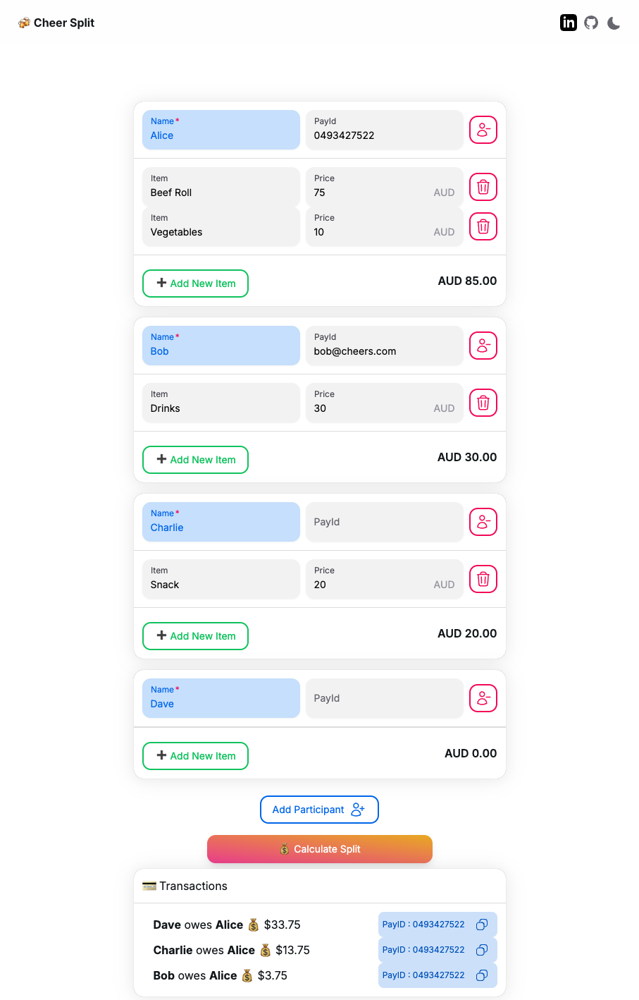

# **🥂 Bill Splitting App**
> A **Next.js-based bill-splitting app** using TypeScript. Supports **PayID, BSB & Account Number** for seamless payments and generates shareable receipts.

---
## **✨ Features**
✅ **No Backend Required** – Fully client-side using Next.js  
✅ **User-Friendly Payment Details** – Easily enter and copy PayID / BSB & Account Number for seamless transactions  
✅ **Dynamic Bill Calculation** – Add participants and expenses dynamically  
✅ **Minimal Transactions** – Uses a **Greedy Two-Pointer Algorithm** for optimization  
✅ **Responsive UI** – Optimized for desktop and mobile

---

## **🔗 Try It Online**
You can check out the live version of the app here:  
👉 [cheers-split.vercel.app](https://cheers-split.vercel.app/)

---

## **📦 Tech Stack**
- 🌐 **Framework**: [Next.js](https://nextjs.org/)
- 💻 **Language**: TypeScript
- 🎨 **UI Library**: HeroUI, Tailwind CSS
- ⚡ **State Management**: React Hooks (`useState`)
- 📜 **Data Handling**: Local state (No backend required)

---

## **🏠 Run Locally**
### **1️⃣ Clone the Repository**
```sh
git clone https://github.com/AutomaticOrca/cheers-split
cd bill-splitting-app
```

### **2️⃣ Install Dependencies**
```sh
npm install
# or
yarn install
```

### **3️⃣ Run the App**
```sh
npm run dev
# or
yarn dev
```
Open [http://localhost:3000](http://localhost:3000) in your browser.

---

## **🧮 Bill-Splitting Algorithm**
This app ensures **fair expense sharing** by determining **who owes whom** with the **fewest transactions possible**.

### **🔢 How It Works**
1. **Calculate each participant’s total spending.**
2. **Determine the fair share** each person should have paid.
3. **Find each participant's balance** by computing `(paid - fair share)`.
4. **Sort participants** from most underpaid to most overpaid.
5. **Match debtors with creditors efficiently** using a **greedy two-pointer approach** to minimize the number of transactions.

### **💰 Example**
- Alice paid **$60**, Bob paid **$30**, and Charlie paid **$0**.
- **Total bill = $90**, so each person's fair share is **$30**.
- **Alice overpaid by $30**, Charlie **underpaid by $30**.
- **Charlie → Alice: $30** (only one transaction needed 🎉).

### **⏳ Time & Space Complexity**
- **Sorting participants**: `O(n log n)`
- **Matching debts**: `O(n)`
- **Total Complexity**: **`O(n log n)`**, making it highly efficient.

---

## **📸 Screenshots**


---

## **🔮 Future Enhancements**
✅ Export Transactions to Image or text  
✅ Multi-Currency Support  

---

### **🌟 Show Your Support**
If you like this project, **give it a ⭐ on GitHub!** 🚀🥂


